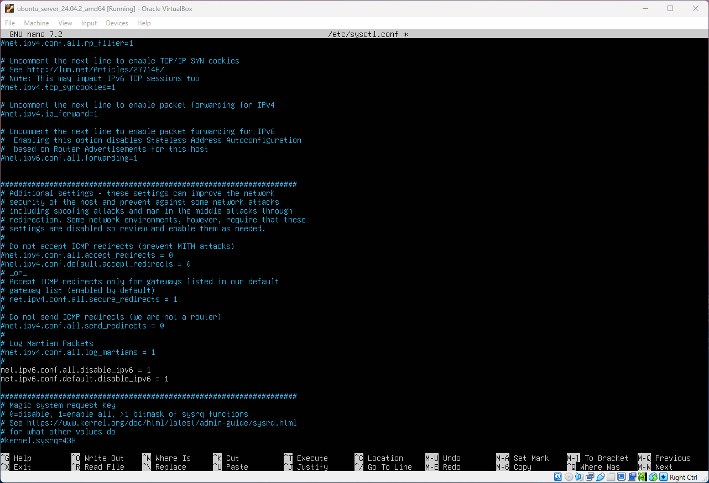

# Extra Configurations to Secure Ubuntu
In this file we will look at some smaller changes that can be made to make the Ubuntu system, or any Linux distro, more secure.

**Objectives:**
* Disable Automounting
* Local warning login banner
* Disable IPv6
* Enable Audit Service

**📁Files accessed:**
* */etc/issue* - To configure warning message before the user login into the system.
* */etc/sysctl.conf* - Was used to disable IPv6.

## Disable Automounting
**Autofs** allows the automatic mounting of devices, typically including CD/DVDs and USB drives. With automounting enabled, anyone with physical access could attach a USB drive or disc and have its contents available in the system even if they lacked permission to mount it themselves. **autofs** should be removed or disabled.
To verify if the **autofs** is not enabled, run the following command:

> systemctl is-enabled autofs

It should say: "disabled"
or run the following command to verify that autofs is not installed

> dpkg -s autofs

In my case its not installed.

## Ensure the Local Login Banner is Configured Properly
Warning messages inform users who are attempting to log in to the sytem of their legal status regarding the system and must include the nae of the organisation that owns the system and any monitoring policies that are in place.

This can be edited in the */etc/issue* file. Remove any instances of **\m, \r, \s, \v** or references to the **OS platform** to make sure that only necessary information is displayed.
Inside that file you can enter something like this: "Authorised users only. All activity may be monitored and reported."

The results of changing the file contents are shown below:

## Disable IPv6
If IPv6 or dual stack is not to be used, it is recommended that IPv6 be disabled to reduce the attack surface of the system. To disable IPv6 through sysctl settings, set the following paramters in */etc/sysctl.conf* or */etc/sysctl.d/* file:

> net.ipv6.conf.all.disable_ipv6 = 1

> net.ipv6.conf.default.disable_ipv6 =1

To disable it in the command console and not the file then run the following commands:

> sysctl -w net.ipv6.conf.all.disable_ipv6=1

> sysctl -w net.ipv6.conf.default.disable_ipv6=1

When IPv6 is disabled via sysctl and is still in the disabled state the output would contain "1" for specific entries:

> sysctl -a 2>/dev/null | grep disable_ipv6

.png)

The results are shown in the screenshot above. If all those settings set to "1" that means changes are successful.

