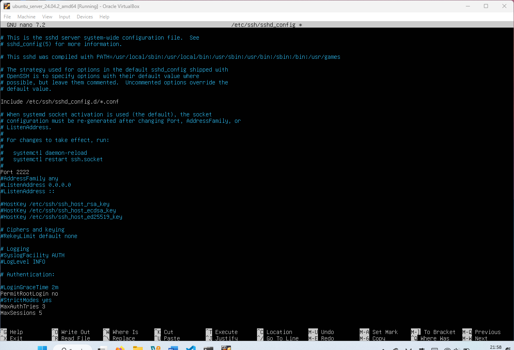
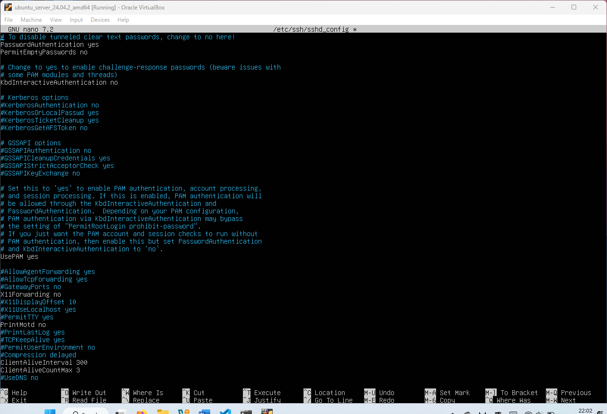

# Hardening the SSH Connection
The OpenSSH server reads a configuration file when it is started. Usually, this file is */etc/ssh/sshd_config*, but the location can be changed.

**Objectives:**
* Install OpenSSH server
* Disable root login
* Enable password authentication
* Disable X11 forwarding
* Set idle interval and the certain number of users allowed at the same time

**📁Files accessed:**
* */etc/ssh/sshd_config*

## Securing SSH
To configure any security settigns for the ssh navigate to the file */etc/ssh/sshd_conifg*. If you don't have *sshd_config* file then this means that the OpenSSH server is not installed on your system. To install the OpenSSH server type the following command:

> sudo apt install openssh-server

After running this it will isntall the OpenSSH and create a sshd_config file for you. Open this file and change the following options.

**Port 2222** - First we will change the defult port number 22 to any other available port numbers. This doesn't mean that hackers won't find it but it can prevent some bots (not all of them) actually scanning it.

**PermitRootLogin no** - This essentially prevents users login in remotely into a root user. If they want to use the root privilages then they should use **sudo** command.

**MaxAuthTries 3** - To prevent brute force attacks we can set that a user can get 3 tries to enter a correct password.

**MaxSessions 5** - With this option you can set the number of users can use SSH connection at the same time. Its better to limit the number of sessions to the number of employees you have or the number of users need to have this access. This can prevent a denial of service attack.

**PasswordAuthentication yes** and **PermitEmptyPasswords no** - Next we need to allow the password authentication to make sure the users have to enter the password when they try to log in remotely. In addition to that, we also need to disable empty passwords, to make sure no one can enter the system without proper authentication.

**X11Forwarding no** - Also a small addition to security, by disabling X11 forwarding it removes the graphical user interface (GUI) when connecting remotely. This will force the users to use command console. Disabling it can be useful if the system supports GUI.

**ClientAliveInterval 300** - Then we need to set the idle time before being logged out of the system, in my case I will set it to 5 minutes. Its important to set the idle time because if for example a user gets distracted and forgets to disconnect from the system, this will create unnecessary traffic and also will posses a risk of unauthorised access to the system files. By setting time we minimise those risks.

**ClientAliveCountMax 3** - It sets the number of alive messages which may be sent without sshd receiving any message back from the client. Basically its adds extra rule to the idle state of the user. 

Other options can be configured to your system requirements but in my opinion the settings I configured are a must have. Save the file and then run the following command to apply the changes to the system:

> sudo systemctl restart sshd

After the service has restarted you can check if the changed settings work by using any other VM to remotely log into your machine with secure ssh.
