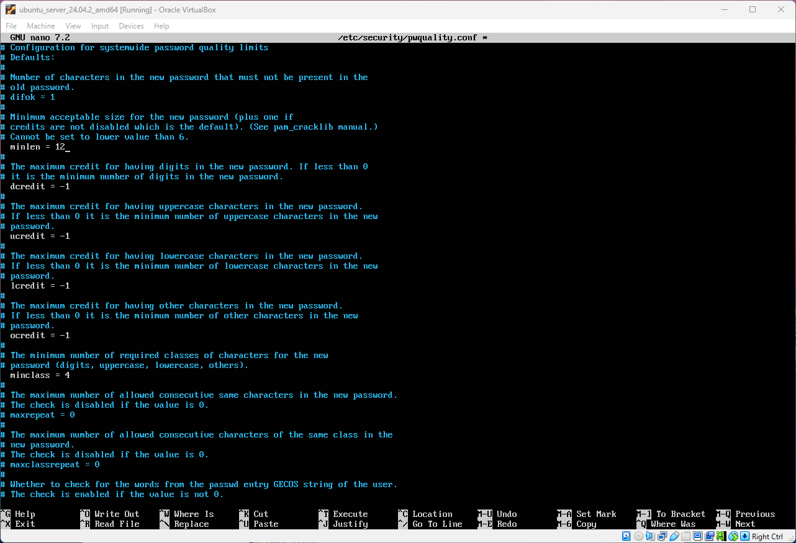
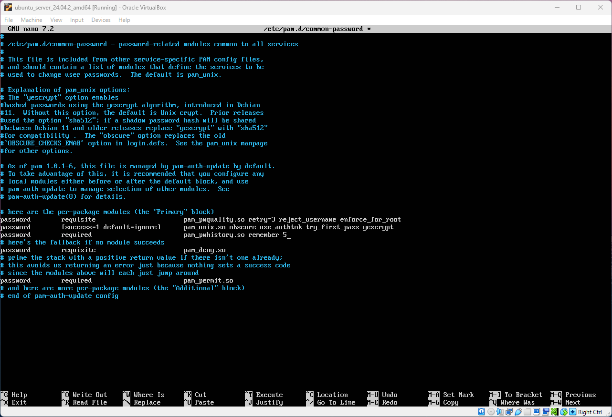
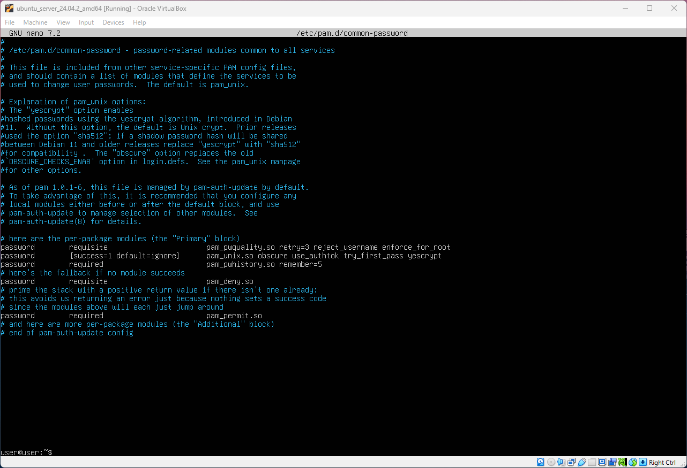

# Password Policy Configuration
Password policies exist to ensure that a strong password is set for users and as a Linux user, you should be mindful to enforce these policies to make it difficult for breaches to occur. You surely do not want users configuring weak or guessable passwords which can be brute-forced by hackers in a matter of seconds. In this file I investigate how to enforce password policies in a Linux environment.

**Objectives:**
* Install libpam-pwquality package.
* Configure password complexity requirements.
* Configure password reuse limit.
* Make sure password hashing is enabled.
* Ensure minimum days between password changes are configured.

**📁Files accessed:**
* */etc/security/pwquality.conf*
* */etc/pam.d/common-password*
* */etc/login.defs*

## Make sure Password Complexity Requirements are configured
First of all before we can configure complexity of the password we need to install **pam** package by using the following command:

> sudo apt install libpam-pwquality

The **pam_pwquality.so** module is used for strength checking for passwords. Once the user types the password it will check its strength against system dictionary and a set of rules that have been defined by system administrator or user. The module itself is based on **pam_cracklib** module and its backwards compatible with its options.
To configure the set of rules for the strength checking for password, navigate to */etc/security/pwquality.conf*.

The first step is to set the minimum length of the password to 12 characters long. 

> minlen = 12

While NIST framework says that minimum length should be 8 characters, but its recommended length is 15 characters long. I decided to stick somewhere in the middle.
Then we need to set rules that the password should contain at least one decimal. symbol, and upper and lower case character. For this configuration -1 actually means at least one instance.

> dcredit = -1  -> Decimal
> ucredit = -1  -> Uppercase
> lcredit = -1  -> Lowercase
> ocredit = -1  -> Symbol

Once everything is set, save the file and exit it.

## Ensure Password Reuse is Limited and Password Hashing is Enabled
To configure password reuse and passsword hashing navigate to */etc/pam.d/common-password*.

The first thing is to check if the number of allowed incorrect passwords is set to 3. If it doesn't have it you should add the following line to the configuration file:

> password requisite pam_pwquality retry=3 reject_username enforce_for_root

You probably noticed that I added additional rules to it. The **reject_username** essentially checks if the password contains the username, **enforce_for_root** basically doesn't exclude the root from the rules that are set.
Then check if the password hashing is set, you should have a following line:

> password [success=1, defult=ignore] pam_unix.so obscure use_authtok try_first_pass yescript

In this line we set the hashing to yesscript, the other 3 rules are optional. If you are using debian 11 version for your linux then change yescript to SHA512 as its more compatible with older debian versions. However yescript is considered a better option as its main purpose is to hash passwords.
To add password reuse limit add the following line to the configuration file:

> password required pam_pwhistory.so remember=5

This will ensure that same password cannot no be reused for 5 new passwords for the same user.

## Configuration of Minimum Days Between Passwords Changes and Expiration date.
The configuration for these settings is located in another file: */etc/login.defs*

To set expiration date for the password change the defult value from 9999 to 365. Those values represent days, so password will be valid for 1 year.

> PASS_MAX_DAYS 365

To set the minimum days the password cannot be change after setting a new password, set the value 1 (day).

> PASS_MIN_DAYS 1

Also it will be ideal if the users get notified that the password will be expired soon. To set the number of days the warning is given before password expiration date, change the following option:

> PASS_WARN_AGE 7

So the warning will be given 7 days in advance, before the password will be expired.

After all the files have been configured, reboot your system and the changes will be applied.
