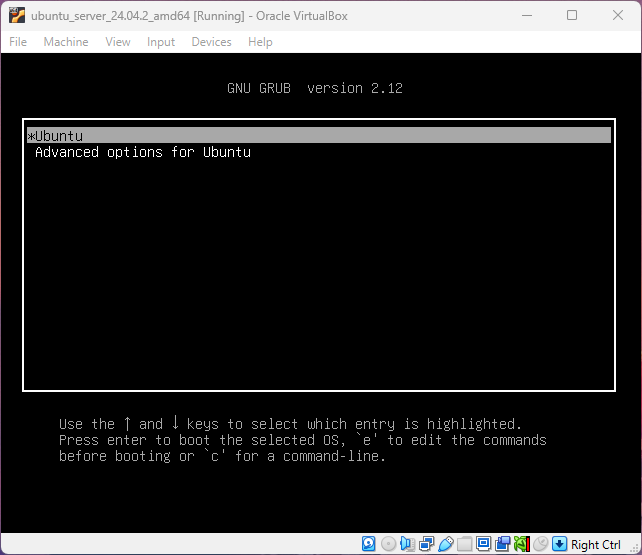
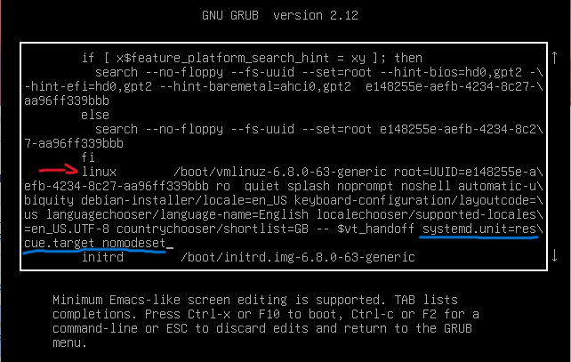
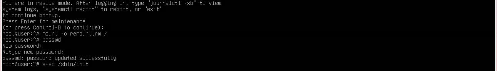
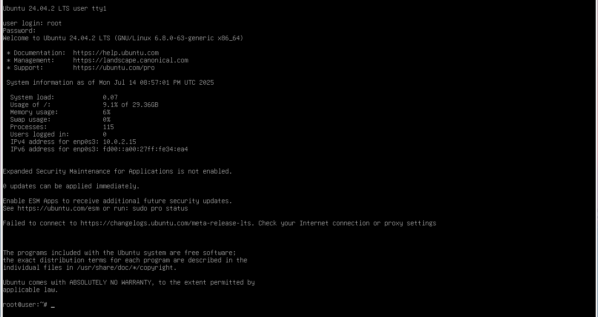
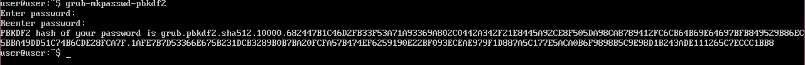
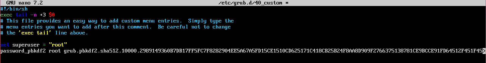
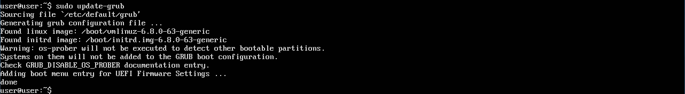
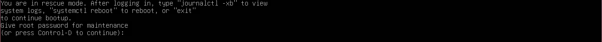

# Single User Mode
The majority of Linux distros allow admins to access the single-user mode when there are some technical problems in the system. This mode boots into minimal environment where only essential services are running. However, this could be a serious problem when users with malicious intent get physical access to the system. It can be done by accessing grub console and editing the bootloader.

**Objectives:**
* Enter into single user mode through boot menu by editing kernel line.
* Change the root password while in a single user mode.
* Secure single user mode by setting a password for it.

**📁Files accessed:**
* */etc/grub.d/40_custom* - to add custom entries.

## Accessing Single User Mode
As soon as the boot process starts press **ESC** to bring up GRUB boot prompt. In this stage press E to edit the first boot option where you can edit the Linux kernel.
Find a kernal line that starts with "*linux*". Then at the end of that kernal line add either (systemd.unit=rescue.target) or (init=/bin/bash), both of commands will take you into single user mode.
> [!Note]
> Sometimes it may not boot up properly when going into Single User Mode, if it does so add "nomodeset" at the end of kernel line where you added previous instructions instructions.

The photo above shows how the "*linux*" line looks like in boot entry. Then press **ctrl + x** or **F10** to boot. It will boot into a recovery/single user mode without asking for any passwords. Now I will show why it could be a serious problem if someone who is not authorised access it. In this example I will change the root password, which can be a way to recover or get access to root user.

> mount -o remount,rw /

Before making changes to the root password we need to remount the root directory into read and write mode. This will allow to perform changes to the root file system. 

> passwd

Before making changes to the root password we need to remount the root directory into read and write mode. This will allow to perform changes to the root file system. 

> exec /sbin/init

Once everything is done we can use the command above, it will boot the system normally which will allow us to log into any users.
The following image shows that the change to the root user password was successful.

## Securing Single User Mode

In the image above to create a hash for your choosen password, we need to run a following command:

> grub-mkpasswd-pbkdf2

It will prompt to enter a password, any password, and asks to repeat your password. Once its done it will generate a hash which needs to be written down somewhere.
Once you written you hash down or saved it somewhere, navigate to */etc/grub.d directory* where you should have a file called 40_custom.

Use **sudo nano** to edit this file. Set superuser, it can any user you like. Next add hash of your password.

Why not use */etc/defult/grub* file? because while its still has configurations for the kernel however it is auto generated so if there are any patches or upgrades that changes kernel settings then your changes will be overwritten 😁. On other hand, */etc/grub.d/40_custom* because it will not be changed with any package upgrades and still allow to make some changes to GRUB menu entries.

To make sure the changes applied, run the following command:

> sudo update-grub

Once all the changes have been applied, try to enter single user mode again...

When you try to log into the single user mode it will now ask for a password. This will keep the system safe from unauthorised access into single user mode. 
